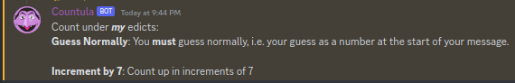
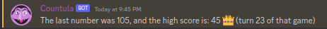
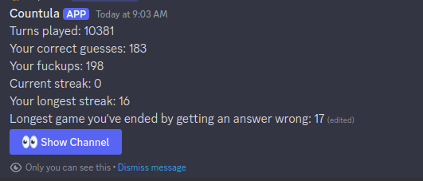

# Countula

Countula is a discord bot which runs a counting game!

It may be slightly evil.

  

## Usage

### Commands

-   `!list` - List the available commands
-   `!help` - Provides "help" to the user
-   `!rules` - Provides the rules of the game

-   `!state` - Provides the current state of the game

-   `!version` - Provides the version of the bot

### Slash Commands

-   `/count stats (Global|Channel)` - Allows users to view their stats for the current channel or globally, and has a button to share with the channel.

## Setup

For setup instructions, please see the [GitHub Repo here](https://github.com/Zaptross/countula)
