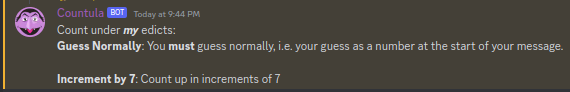
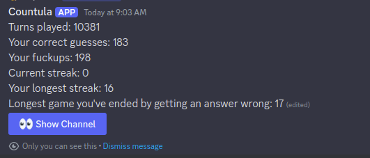

# Countula

Countula is a discord bot which runs a counting game!

It may be slightly evil.

  

## Usage

### Commands

-   `!list` - List the available commands
-   `!help` - Provides "help" to the user
-   `!rules` - Provides the rules of the game

-   `!state` - Provides the current state of the game

-   `!stats` - Lists the stats of the user

-   `!version` - Provides the version of the bot

## Setup

Before deploying your own, you will need to make a discord bot, and add it to your server.

-   Discord application creation: https://discord.com/developers/applications
-   Discord oauth2 link generator(with correct permissions preconfigured): https://discordapi.com/permissions.html#68672

Ensure that you enable the `MESSAGE CONTENT INTENT` in the bot settings, otherwise the bot will not be able to read messages.

## Deployment

### Docker

You can check out the image versions over on [Docker Hub](https://hub.docker.com/r/zaptross/countula)

1. Clone the repo to your local machine
2. Duplicate `./example.env` and rename it to `.env`
3. Fill out the env variables
4. In a terminal in the repo root, run `docker-compose up -d`

### Kubernetes with Helm

1. Clone the repo to your local machine
2. Fill out the values in `helm/values.yaml`
3. Run `helm install countula ./helm`
4. Run `kubectl get pods` to see the status of the pod
